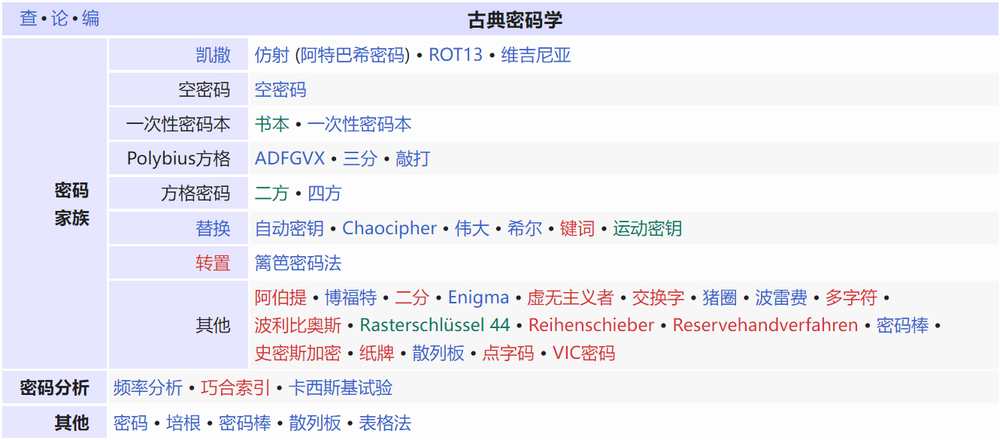
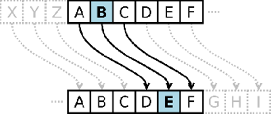

## 古典密码 / Classic cryptography

### 简述

**「古典密码学 Classic cryptography 」** 在形式上可分成 **「移位密码 Shift Cipher 」** 和 **「替代密码 Substitution Cipher」** 两类，其中 **替代密码** 又可分为 **单表替代** 和 **多表替代**。有时则是两者的混合。其于历史中经常使用，但现代已经很少使用，大部分的已经不再使用了。

> 图：[中文wiki-古典密码](https://zh.wikipedia.org/wiki/%E5%8F%A4%E5%85%B8%E5%AF%86%E7%A2%BC)

### 移位密码

移位式密码，它们字母本身不变，但它们在消息中顺序是依照一个定义明确的项目改变。许多移位式密码是基于[几何](https://zh.wikipedia.org/wiki/幾何)而设计的。一个简单的加密（也易被破解），可以将字母向右移1位。例如，明文"Hello my name is Alice."将变成"olleH ym eman si ecilA."。

#### 栅栏密码 Rail-fence

**「栅栏密码 Rail-fence Cipher 」** 就是把要加密的明文分成N个一组，然后把每组的第1个字符组合，每组第2个字符组合...每组的第N(最后一个分组可能不足N个)个字符组合，最后把他们全部连接起来就是密文，这里以 **key =  2** 栏栅栏加密为例。

```
明文：Squdgy fez, blank jimp crwth vox
分组：Sq ud gy  f ez ,  bl an k  ji mp  c rw th  v ox 
将每组以前后顺序上下展开：
第一行 S u g   e , b a k j m   r t   o
第二行 q d y f z   l n   i p c w h v x
得密文 Sug e,bakjm rt oqdyfz ln ipcwhvx
```

#### 曲路密码 Curve

**「曲路密码 Curve Cipher」** 是一种按照双方约定密钥路径加解密的换位密码。

明文： `The quick brown fox jumps over the lazy dog`

填入5行7列表(事先约定填充的行列数)

 

加密的回路线(事先约定填充的行列数)

 

密文： `gesfc inpho dtmwu qoury zejre hbxva lookT`           

#### 列移位密码 Columnar Transposition

**「列移位密码 Columnar Transposition Cipher」** 一种比较简单，易于实现的换位密码，通过一个简单的规则将明文打乱混合成密文。

以明文 `The quick brown fox jumps over the lazy dog`，密钥 how are u 为例。

填入5行7列表(事先约定填充的行列数，如果明文不能填充完表格可以约定使用某个字母进行填充)

 

密钥： `how are u`

按how are u在字母表中的出现的先后顺序进行编号，我们就有a为1,e为2，h为3，o为4，r为5，u为6，w为7，所以先写出a列，其次e列，以此类推写出的结果便是密文：

 

密文： `qoury inpho Tkool hbxva uwmtd cfseg erjez`

### 替代密码

替代密码是字母（或是字母群）作有系统的代换，直到消息被替换成其它难以解读的字。

替换式密码亦有许多不同类型。如果每一个字母为一单元（或称元素）进行加密操作，就可以称之为 **「简易替换密码 simple substitution cipher」** 或 **「单表加密 monoalphabetic cipher 」** 另又称为 **单字母替换加密** ;  以数个字母为一单元则称为 **「多表加密 polyalphabetic cipher」** 或  **「表格式加密 polygraphic」**。

#### 阿特巴希密码 Atbash

**埃特巴什码**，密文表是明文表的逆转：

```
明文表：ABCDEFGHIJKLMNOPQRSTUVWXYZ 

密文表：ZYXWVUTSRQPONMLKJIHGFEDCBA
```

明文：`the quick brown fox jumps over the lazy dog` 

密文：`gsv jfrxp yildm ulc qfnkh levi gsv ozab wlt`

#### 猪圈密码 Pigpen

 **「猪圈密码 Pigpen cipher」** ，亦称 **「共济会密码 Masonic cipher」**   或  **共济会员密码 Freemason's cipher」**，是一种以格子为基础的简单 **单表固定** 替换密码。

 


#### 圣堂武士密码 Templar

~~圣堂武士密码亮出光刃！(什~~，**「 圣堂武士密码 Templar Cipher 」** 是共济会的猪圈密码的一个变种，一直被共济会圣殿骑士用。

 

#### 培根密码 Bacon

**培根密码**，又名 **「倍康尼密码 Bacon's cipher」**  是由[法兰西斯·培根](https://zh.wikipedia.org/wiki/法蘭西斯·培根)发明的一种[隐写术](https://zh.wikipedia.org/wiki/隱寫術)。

加密时，[明文](https://zh.wikipedia.org/wiki/明文)中的每个字母都会转换成一组五个英文字母。其转换依靠下表：

```
a   AAAAA   g     AABBA   n    ABBAA   t     BAABA
b   AAAAB   h     AABBB   o    ABBAB   u-v   BAABB
c   AAABA   i-j   ABAAA   p    ABBBA   w     BABAA
d   AAABB   k     ABAAB   q    ABBBB   x     BABAB
e   AABAA   l     ABABA   r    BAAAA   y     BABBA
f   AABAB   m     ABABB   s    BAAAB   z     BABBB
```

这只是一款最常用的加密表，有另外一款将每种字母配以不同的字母组予以转换，即I与J、U与V皆有不同编号。

#### 凯撒密码 Caesar

**凯撒密码**（或称恺撒加密、恺撒变换、变换加密、位移加密）是一种 **单表代换** 替换加密，明文中的所有字母都在字母表上向后（或向前）按照一个固定数目进行偏移后被替换成密文。例，当 偏移量 **Key = 3** 的时候，所有的字母A将被替换成D，B变成E，以此类推。

{ width="50%" } 

#### 维吉尼亚密码 Vigenère Cipher

**维吉尼亚密码** 是在单一恺撒密码的基础上扩展出 **多表代换** 替换加密，根据密钥(当密钥长度小于明文长度时可以循环使用)来决定用哪一行的密表来进行替换，以此来对抗字频统计。

{ width="50%" } 

在一个[凯撒密码](https://zh.wikipedia.org/wiki/凱撒密碼)中，字母表中的每一字母都会作一定的偏移，例如偏移量为3时，`A`就转换为了`D`、`B`转换为了`E`……而维吉尼亚密码则是由一些偏移量不同的凯撒密码组成。

为了生成密码，需要使用[表格法](https://zh.wikipedia.org/wiki/表格法)。这一表格包括了26行字母表，每一行都由前一行向左偏移一位得到。具体使用哪一行字母表进行编译是基于密钥进行的，在过程中会不断地变换。

例如，假设[明文](https://zh.wikipedia.org/wiki/明文)为：

```
ATTACKATDAWN
```

选择某一关键词并重复而得到密钥，如关键词为`LEMON`时，密钥为：

```
LEMONLEMONLE
```

对于明文的第一个字母`A`，对应密钥的第一个字母`L`，于是使用表格中`L`行字母表进行加密，得到[密文](https://zh.wikipedia.org/wiki/密文)第一个字母`L`。类似地，明文第二个字母为`T`，在表格中使用对应的`E`行进行加密，得到密文第二个字母`X`。以此类推，可以得到：

```
明文：ATTACKATDAWN
密钥：LEMONLEMONLE
密文：LXFOPVEFRNHR
```

解密的过程则与加密相反。例如：根据密钥第一个字母`L`所对应的`L`行字母表，发现密文第一个字母`L`位于`A`列，因而明文第一个字母为`A`。密钥第二个字母`E`对应`E`行字母表，而密文第二个字母`X`位于此行`T`列，因而明文第二个字母为`T`。以此类推便可得到明文。

用数字0-25代替字母`A`-`Z`，维吉尼亚密码的加密文法可以写成[同余](https://zh.wikipedia.org/wiki/同余)的形式：
$$
\begin{align*}
C_i & \equiv (P_i + K_i) \mod 26 \\
\end{align*}
$$
解密方法则能写成：
$$
\begin{align*}
P_i & \equiv (C_i - K_i) \mod 26
\end{align*}
$$

### 小结

- [quipquip 自动化的替换密码解算器 ](https://quipqiup.com/)
- [CTF在线工具](http://www.hiencode.com/)

许多古典密码可单单经由密文而破解，所以它们容易受到 **「唯密文攻击法 ciphertext-only attack，COA 」** 攻击。

有些古典密码（像是凯撒密码）的密钥个数有限，所以这类密码可以使用 **暴力破解** 尝试所有的密钥。

替代式密码有比较大的密钥数，但是容易被频率分析，因为每个密码字母各代表了一个明文字母。

多字母替代式密码密码，像是[维吉尼亚密码](https://zh.wikipedia.org/wiki/维吉尼亚密码)使用多个替换防止了简单的频率分析，然而，更先进的技术[卡西斯基试验](https://zh.wikipedia.org/wiki/维吉尼亚密码#卡西斯基试验)就可用来破解这类密码。

古典密码的常见变换在上述介绍的几种常见密码中已经体现，所以其他类似变换的古典密码就不再赘述，总的来说，在算力和统计学的双双加持下，古典密码再也不能满足安全应用，同时在CTF中也不会作为核心考点出现，同编码一样，结合搜索引擎去解决对应问题即可，如果解决不了——题有问题。
