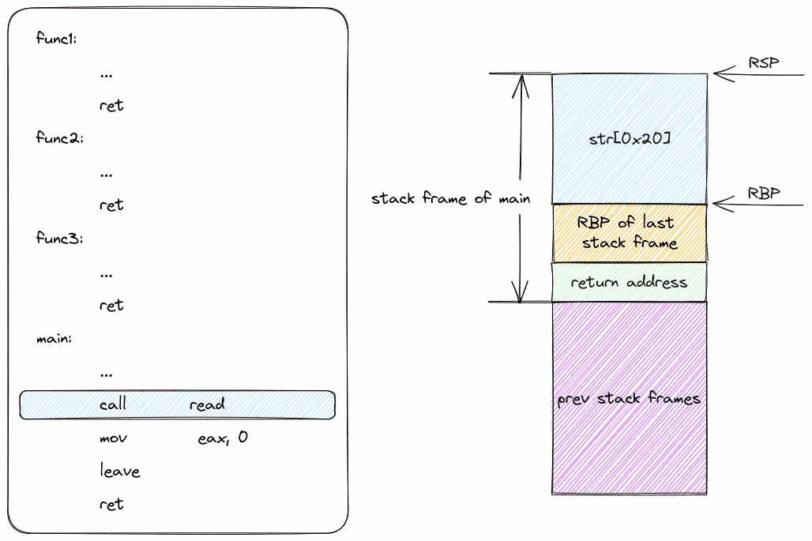
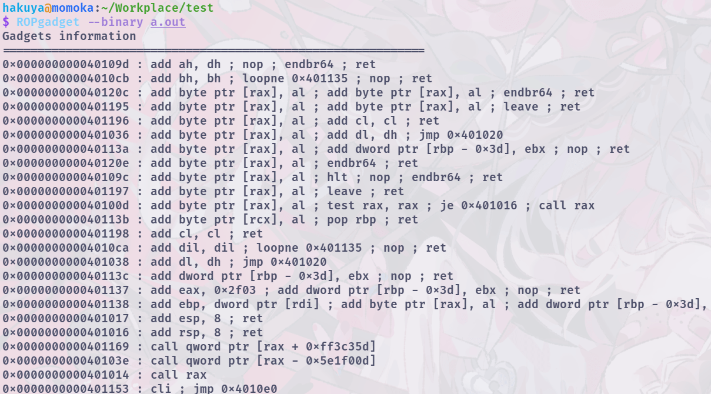

前面我们已经知道了可以通过覆盖返回地址控制程序流，但是只能实现使程序执行到某一个地址继续执行，还不能实现复杂的逻辑。接下来，就一起来看看如何基于覆盖返回地址实现复杂逻辑。

## 面向返回编程（ROP）

### ROP原理

ROP的主要目的便是通过在合适的位置布置一连串的返回地址，从而实现相对复杂的逻辑。举个栗子，我们已经在 [Stack_Overflow](./Stack_Overflow.md) 中学习到了如何劫持返回地址，但是我们所做的只是一个跳转至“后门函数”，其距离可以真正劫持到恶意代码上还有很远的路要走，而ROP就是一种解决方案，其通过精心布局栈上的地址来完成复杂逻辑的跳转

#### 32位 ROP
一切，先从32位的ROP开始，其实大部分教材都是从64位开始的，但是64位开始会给新手在参数传递的过程中带来一定的迷惑性，因此我们从32位开始，先让我们回到ret之前的操作，假设溢出处的汇编指令如下
```asm
0x400000 func:
0x400000    mov eax, 0xdeadbeef
0x400004    ret
0x400005 main:
0x400005    call func
0x400009    mov eax, 0
0x40000b    ret
```

并且我们的栈帧如下图所示：

| 地址 | 值 | 如果值为指针，其指向的地址 | RSP |
| ---------- | ---------- | ---------- | ------- |
| 0x0000000c | 0x400005 | mov eax, 0 | <- |
| 0x00000008 | 0x00000000 | 0x00000000 |  |
| 0x00000004 | 0x00000000 | 0x00000000 |  |
| 0x00000000 | 0x00000000 | 0x00000000 |  |

按照正常情况下，进行返回，如果劫持返回，我们其实已经知道，很简单，溢出修改`0x000000c` 处的值使得 `0x400005`变成我们想要的地址即可，但是其只能干最简单的事情，想要真正劫持程序需要的是什么？当然是getshell了，那么在二进制如何getshell？当然是 system("/bin/sh") 了！

现在假设system的地址是`0xf7000000`，那么我们理所当然想要将 `0x400005` 修改为 `0xf7000000`，于是问题就出现了，`"/bin/sh"`从哪来？

还是先假设，`"/bin/sh"`的地址是`0xdeadbeef`

那么我们就需要在ROP的时候将`0xdeadbeef`传递给`0xf7000000`，但是怎么传？？？一脸问号是吧，既然ROP很难理解，不妨我们回到最开始，来看看函数调用的过程中32位下是如何传递参数的

考虑一个参数的函数`foo`，我们想要调用`foo(233)`，汇编应该是这样的
```asm
push 233
call foo
nop
```
我们来看看这个过程中函数栈帧的变化

| 地址 | 值 | 如果值为指针，其指向的地址 | RSP |
| ---------- | ---------- | ---------- | ------- |
| 0x0000000c | 0 |  | <- |
| 0x00000008 | 0 |  | |
| 0x00000004 | 0 |  | |
| 0x00000000 | 0 |  | |

首先第一步 push 233，其实就是将233压入栈中

| 地址 | 值 | 如果值为指针，其指向的地址 | RSP |
| ---------- | ---------- | ---------- | ------- |
| 0x0000000c | 0 |  | |
| 0x00000008 | 233 |  | <- |
| 0x00000004 | 0 |  | |
| 0x00000000 | 0 |  | |

第二步 call foo，其实就是将当前的返回地址压入栈中，然后跳转到foo函数

| 地址 | 值 | 如果值为指针，其指向的地址 | RSP |
| ---------- | ---------- | ---------- | ------- |
| 0x0000000c | 0 |  | |
| 0x00000008 | 233 |  | |
| 0x00000004 | call foo的下一条指令 | nop | <- |
| 0x00000000 | 0 |  | |

好，到此为止，大家思考一个问题，是不是当`foo`函数返回的时候（即ret指令执行的时候），RSP（ESP）应该也在这个位置，想明白了就继续往下看，没想明白就先想想

现在这一瞬间，是`foo`开始执行的时候，RSP（ESP）指向返回地址，而它需要的参数位于RSP + 4的位置，是否意味着，如果我们通过ROP劫持返回地址到`foo`的时候，我们应该确保进入`foo`函数的瞬间 RSP + 4的位置应该是它的第一个参数？同时RSP为`foo`的返回地址

最后，我们将`foo`函数看做是`system`函数，是不是意味着，如果我们想要通过ROP劫持返回地址到`system`的时候，我们应该确保进入`system`函数的瞬间 RSP + 4的位置应该是它的第一个参数？同时RSP为`system`的返回地址

那么回到最开始，我们想要劫持返回地址到`system`，我们应该怎么做呢？
我们只需要将栈给覆写成下面这样就好了

| 地址 | 值 | 如果值为指针，其指向的地址 | RSP |
| ---------- | ---------- | ---------- | ------- |
| 0x00000014 | 0xdeadbeef | "/bin/sh" | |
| 0x00000010 | 0x00000000 | 空 | |
| 0x0000000c | 0xf7000000 | system的开始 | <- |
| 0x00000008 | 0x00000000 |  |  |
| 0x00000004 | 0x00000000 |  |  |
| 0x00000000 | 0x00000000 |  |  |

这样，当存在漏洞的函数执行`ret`命令时，首先会因为`ret`返回到system，此时RSP指向了`0x00000010`其为system的返回值，但是因此我们已经进入了`system`函数，因此`system`要返回到哪里去与我们无关，我们getshell了就行了，不需要下一步了。而此时，RSP + 4为`"/bin/sh"`，其就理所当然地成为了`system`的第一个参数，从而getshell成功

那么，以上的所有事情，前提都是我们知道`system`的地址和`"/bin/sh"`的地址，那么我们如何知道这两个地址呢？这就需要我们去寻找gadget了，这个在后门中我们再讨论，现在我们先讨论如果需要在ROP中按顺序调用多个函数的情况

其实你也猜到了，我们之前劫持到`system`的时候还有个`system`的返回地址是留空的没有使用呢，其实只需要将这个留空改成下一个函数的地址就好了，这样就可以实现按顺序调用多个函数，至于传参，这是一个大坑，之后填

#### 64位 ROP
64位的ROP在我看来，其实比32位的简单多了，因为64位的参数传递是通过寄存器传递的，我们只需要通过控制寄存器的值就可以实现参数传递，因此更多的是通过合适的手段将寄存器修改为我们想要传递的值

先阐述一个事实，在没那么新的gcc中，程序都会被编译进一个 `_libc_init_csu`函数用于初始化，在这个函数中，有一个汇编片段如下

```asm
pop r15
ret
```

其中，`pop r15`占2字节，我们假设其起始地址为`0x8`，那么 `ret`的地址就是 `0xa`，那么问题来了，`0x9`这个地址，它是合法的吗？

事实上确实是合法的，而且很有用，如果从 `0x9`开始看这个代码片段，由于地址错位的问题，代码片段会变成这样

```asm
pop rdi
ret
```

这个字节错位弄出来的代码片段，非常有用，因为其`pop rdi`这条指令，让我们有能力通过栈去修改寄存器了，而这个寄存器就是`rdi`，那么我们就可以通过栈去修改`rdi`的值，从而实现参数传递了

这些有用的代码片段，我们一般就称为gadget

来看看64位下怎么实现和32位一样的ROP吧，还是考虑返回到`system("/bin/sh")`

假设system的地址是`0x7f000000`，`"/bin/sh"`的地址是`0xdeadbeef`

现在覆盖栈如下

| 地址 | 值 | 如果值为指针，其指向的地址 | RSP |
| ---------- | ---------- | ---------- | ------- |
| 0x00000018 | 0x7f000000 | system的开始 | |
| 0x00000010 | 0xdeadbeef | "/bin/sh" | |
| 0x00000008 | gadget | pop rdi; ret | <- |

最后开始颅内模拟一下，首先，`ret`返回到`pop rdi`，此时RSP指向了`0x00000010`，而`pop rdi`会将`0xdeadbeef`赋给`rdi`，这个过程中，RSP指向了`0x00000018`, 然后`ret`返回到`system`，此时RSP指向了`0x00000020`，而`system`的第一个参数就是`rdi`，因此`system`的第一个参数就是`0xdeadbeef`，也就是 `"/bin/sh"`，从而getshell成功，至于`system`的返回地址，我们不需要管，因为我们已经getshell了，但是如果你想实现按顺序调用多个函数，那么你就需要将`0x00000020`改成下一个函数的地址，这样就可以实现按顺序调用多个函数，至于多个参数的传递，这又是一个大坑，之后填

#### 示例

以下面这个程序为例，目标是先后执行`func1`-`func3`

```c
// gcc test.c -no-pie -fno-stack-protector -g
#include <stdio.h>

void func1() { printf("func1 called\n"); }

void func2() { printf("func2 called\n"); }

void func3() { printf("func3 called\n"); }

int main() {
    char str[0x20];

    read(0, str, 0x50);

    return 0;
}
```

对应的exp脚本如下：

```python
#!/usr/bin/python3
# -*- encoding: utf-8 -*-

from pwn import *

# context.log_level = "debug"
# context.terminal = ["konsole", "-e"]
context.arch = "amd64"

p = process("./a.out")

elf = ELF("./a.out")

func1_address = elf.sym["func1"]
func2_address = elf.sym["func2"]
func3_address = elf.sym["func3"]

payload = b"A" * 0x28
payload += p64(func1_address)
payload += p64(func2_address)
payload += p64(func3_address)

p.send(payload)

p.interactive()
```

单看这个脚本可能会有点抽象，下面是栈帧变化的动画演示：



### gadget

现在我们已经能够实现通过在合适的位置布置地址实现按照一定的顺序调用函数。但是这还不够精细，毕竟我们现在还很难控制调用这些函数时传递的参数（可以先了解一下Linux下C语言的调用约定）。这里就需要引入一个新的概念——gadget。

gadget在这里指的是以`ret`指令结尾的代码片段，例如`leave; ret`就是一个很常用的gadget。我们可以利用各种合适的gadget拼凑出需要的程序逻辑。

####  获取gadget

获取gadget可以使用工具`ROPgadget`获取到elf文件中的大部分gadget。如下图



结果可以结合`grep`工具进行搜索，不过我更推荐结合fzf使用，但是这个需要写shell脚本，下面这个是我自己用的shell脚本，能够快速搜索，并把搜索结果存入剪贴板（使用的shell为fish，显示服务器为wayland）

```fish
function find_gadget -d "find gadget from binary file"
    set -l file $argv[1]
    set -l file_md5 (md5sum $file | cut -d ' ' -f 1)

    if ! test -f ./gadget-$file-$file_md5
        ROPgadget --binary $file > ./gadget-$file-$file_md5
    end
    
    set -l result (cat ./gadget-$file-$file_md5 | fzf)

    if test -z $result
        echo "No gadget selected."
        return
    end

    set -l addr (string sub --length 18 $result)

    wl-copy $addr

    echo "The offset of gadget '$result' has been saved to the clipboard."
end
```

#### 示例

已下面这个程序为例，目的是让程序输出`Hello, World!`：

```c
#include <stdio.h>

char *str = "Hello, World!";

void func1() { puts("func1 called"); }

int main() {
    char str[0x20];

    read(0, str, 0x50);

    return 0;
}
```

对应的exp脚本如下：

```python
#!/usr/bin/python3
# -*- encoding: utf-8 -*-

from pwn import *

# context.log_level = "debug"
# context.terminal = ["konsole", "-e"]
context.arch = "amd64"

p = process("./a.out")

elf = ELF("./a.out")

puts_addr = elf.sym["puts"]
str_hello_world = 0x00402004
pop_rdi_ret = 0x0000000000401203

payload = b"A" * 0x28
payload += p64(pop_rdi_ret)
payload += p64(str_hello_world)
payload += p64(puts_addr)

p.send(payload)

p.interactive()
```

栈帧变化的动画演示：


