## Quick Start：Example problems

下面是几道简单的 CTF 逆向 例题
在正式做题之前，我们要厘清解决RE题的大致思路。
#### 1.尝试运行程序，猜测程序的大致运行逻辑
例如`hit-plane.exe`这个文件，我们运行之后发现：

是一个躲避掉落物的小游戏，用WASD可以上下左右移动,下面有一个Score。我们就可以猜测Score达到一定分数的时候我们就能获得flag。从而得到后面的思路。
#### 2.利用查壳工具查询附件的详细信息
运行分析之后，我们就要进入工具分析了。先用查壳工具打开文件。（这里以DIE为例）

可以看到这是一个32位的PE文件，使用了UPX工具进行了打包。下面还有编译器、工具的相关信息。
这些信息在未来我们解题过程中都可能会有帮助。
（文件名和题目的信息也可能是解题相关的提示哦！）
#### 3.进行正式代码分析
获取初步的信息之后，我们就可以使用静态或动态分析工具开始对文件的源代码进行分析和解题了。
其中的技巧和难点非常多，这里先不展开。

------

#### Exp1:

拿到题目之后，从题目名字中的 `"asm"` 可以看出，这是一道考察 `汇编语言` 的题目，我们要有一定的汇编语言基础。下载下来可以看到给了我们一个 txt 文本，那么这里面一定是汇编块。打开之后确实是汇编块。

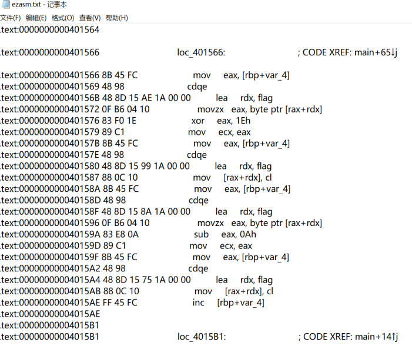{ width="70%" }

那么接下来就是 ~~找到右上方的(x)用小手点击一下鼠标左键~~ 哐哐一顿分析啦，详细的分解步骤就不多说了，这里涉及到汇编语言的知识，我简单解释一下它的逻辑：这段汇编代码的功能是对一个字符串（flag）进行加密处理，然后输出加密后的结果。具体的操作步骤如下：

首先，定义一个变量 `var_4` ，用来存储字符串的索引，初始值为 0。

然后，进入一个循环，对字符串的每个字符进行两次异或和减法操作，具体如下：

- 将 `var_4` 作为偏移量，从 `flag` 中取出一个字符，与十六进制数 `0x1E` 异或，得到新的字符。

- 将新的字符存回 `flag` 中覆盖原来的字符。
- 再次从 `flag` 中取出同一个字符，减去十六进制数 `0x0A` ，得到最终的加密字符。
- 将最终的加密字符存回 `flag` 中覆盖原来的字符。
- 将 `var_4` 加一，准备处理下一个字符。
- 循环结束的条件是 `var_4` 等于十六进制数 `0x27` ，也就是字符串的长度。
- 最后，调用 `printf` 函数，输出加密后的字符串。

下面是我们对这段 ASM 加密算法翻译后的代码：

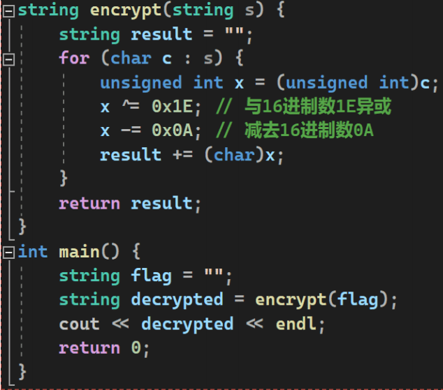{ width="70%" }

那么知道了加密的原理，下面就是解密啦，我们只需要把这段加密过程逆过来运算即可：

- 将每一个字符都加上十六进制数 `0x0A`
- 再将每一个字符都与十六进制数 `0x1E` 进行异或操作
- 最后逐一储存在 `result` 中并返回原始字符串

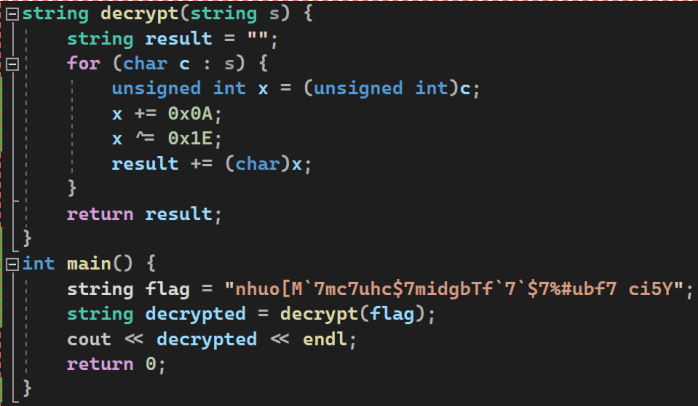{ width="70%" }

将题目提供的加密后的字符串填进去并运行这段代码，即可输出正确的 flag ：`flag{It_is_als0_impor@nt_t0_13arn_4sm!}`

------

#### Exp2:

将题目下载下来，发现这是一个可执行程序，那么我们要做的第一步就是查壳，确定程序的 PE 类型：(查壳图片略)，查壳过后我们发现这是一个 `x64` 可执行程序，打开之后我们会发现他是直接让我们输入 `flag` 的：

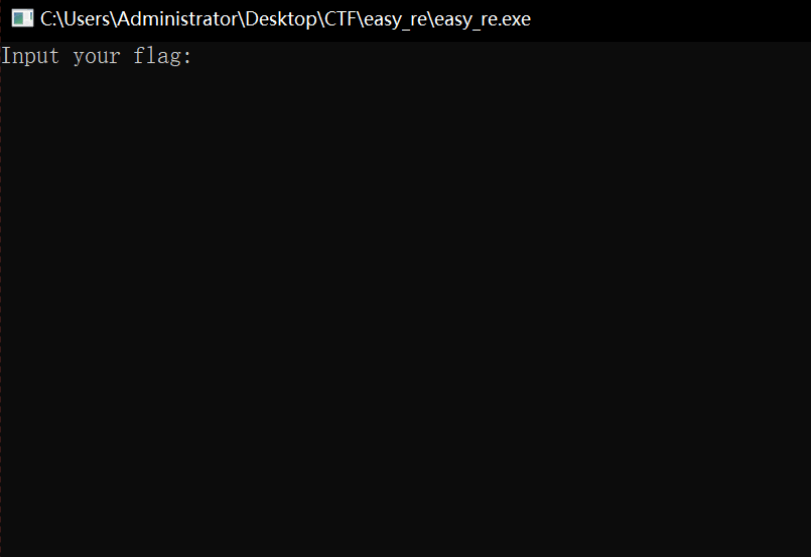{ width="70%" }

那根据我们的直觉或者经验，可以看出，他肯定有一套验证 flag 是否正确的算法，我们直接拖进 IDA 看看之后发现，所有的验证代码全都在 `Main函数` 里，而且没有任何混淆：

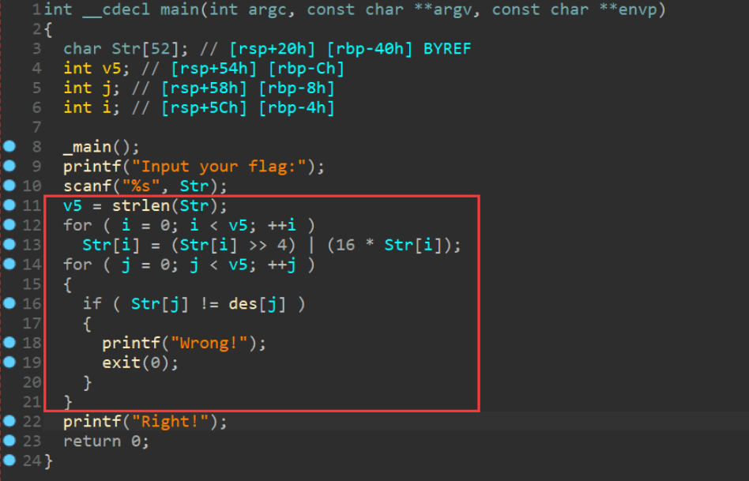{ width="70%" }

从伪代码的这一部分分析可以知道，处理过后的字符串通过与 `des` 字符数组对比，判断是否相等，从而得出是否正确，那么 `des` 的字节就是我们需要的，我们双击 `des` 可以跳转到 `des` 的数据块，从这里可以看到 `des` 的所有字节数据：

{ width="66%" }

我们直接从 HEX 进制窗口中复制这一段字节：

`66 C6 16 76 B7 45 27 97 F5 47 03 F5 37 03 C6 67 33 F5 47 86 56 F5 26 96 E6 16 27 97 F5 07 27 03 26 C6 33 D6 D7 00 00 00 00 00 00 00 00 00 00 00 00 00 00 00 00 00 00 00 00 00 00 00 00 00 00 00`

代码段 `Str[i] = (Str[i] >> 4) | (16 * Str[i]);` 其实是位操作中的典型算法：`位交换`，即把每一个字节的高低位互换位置，那么如果我们想要得到原始数据，就需要把 `des` 的高低位互换回去，我们只需要重新调用一次这个算法即可：

{ width="70%" }

将右图字节集转换为字符串即为 flag：`flag{Try_t0_s0lv3_the_binary_pr0bl3m}`

------

#### Exp3:

下载题目，发现是一个可执行程序，查壳发现是一个 32 位的可执行程序，运行，随便输入一个密钥，会输出给我们一份加密后的字符串，我们直接拖进 IDA 查看 `Main函数`：

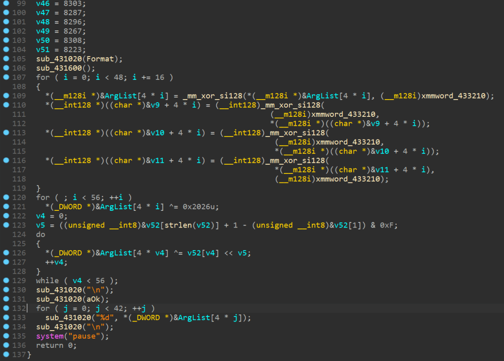{ width="70%" }

进入 IDA 后，我们发现，程序开始对 `ArgList` 已经赋值了，紧接着又对其部分位置的字符进行了修改，此处的代码编译器进行了优化，我们很难看出来他的执行逻辑，那么我们可以另辟蹊径，通过动态调试来拿到修改后的 `ArgList` 的数值，此处动态调试的过程不再展示。紧接着他又利用我们输入的那个密钥对 `ArgList` 进行了进一步的加密，然后输出了加密后的字符串。此处出题人其实是在迷惑我们，其实第一次处理后的 `ArgList` 就是用 `Base64` 编码后的字符串，我们直接动态调试出第一次处理后 `ArgList` 的字节集，然后用伪代码中出题人给的异或算法输出 `Base64` 编码后的字节集，将输出的字节集转换为字符串，并将字符串用 `Base64` 解码即可得到 flag：`flag{a10e7ccc-b802-e3eb-c85940e226d}`

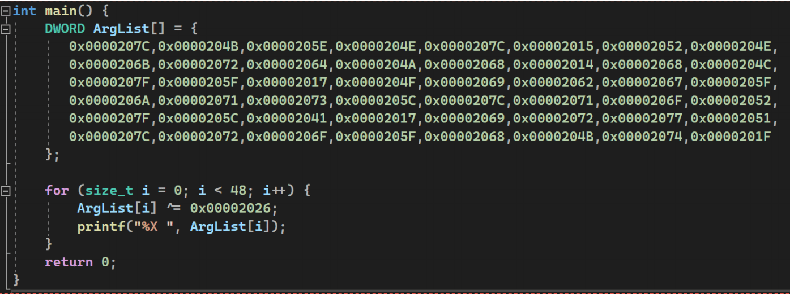{ width="70%" }

{ width="66%" }

------

#### Exp4:

下载题目，发现是一个可执行程序，查壳发现是一个 64 位的可执行程序，运行，啥玩意都没有，我们直接拖进 IDA 查看 `Main函数`，好了，flag 就在眼前：`flag{flag1sinarray}`

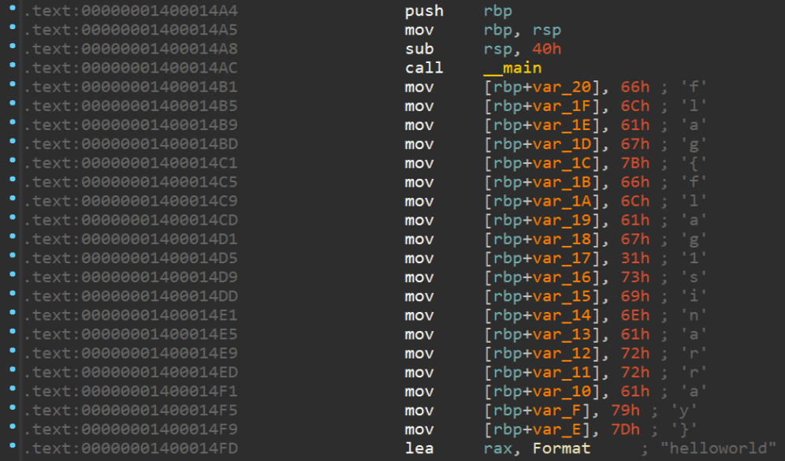{ width="70%" }

------

#### Exp5:

下载题目，发现是一个可执行程序，查壳发现是一个 64 位的可执行程序，运行，直接让我们输入 `flag`，我们直接拖进 IDA 查看 `Main 函数`，可以看到这里与 `Exp1` 是大同小异的，都是异或操作之后与内存中的一串字节 `des` 对比，我们直接逆运算即可得出来原本的输入数据，要注意这里是与取随机数之后的 `v5` 数组进行异或，我们要先模拟 `v5` ，再进行异或。

{ width="70%" }

{ width="70%" }

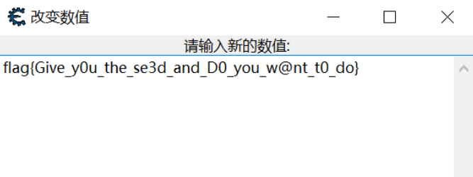{ width="70%" }

------

#### Exp6:

下载题目，发现是一个 `py文件`，里面是关于对 `flag` 进行加密的算法，分析一下算法可知：

- 要求输入 `flag` ，并且程序会检查输入的字符串是否是 `42` 个字符长。如果不是，程序将打印出 `"Check your length!"` 并且退出程序。
- 如果输入的字符串长度符合要求，程序将进入一个循环。在这个循环中，输入的字符串被分成 6 个部分，每个部分包含 7 个字符。然后将每个部分中的字符转换成对应的 ASCII 码，再转换成十六进制的形式。这些十六进制数值会被存储在列表 `l` 中。
- 接下来的部分是一系列的条件判断。程序会检查列表 l 中的值是否满足一组复杂的方程式，其中每个方程式的右边都是一个十六进制数。如果所有的条件都满足，程序会打印 `"Good job!"`，否则打印 `"Wrong/nTry again!!!"` 并退出程序。

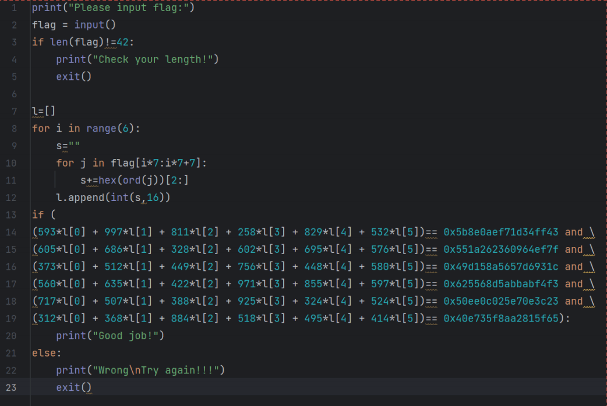{ width="70%" }

其实到了这一步，看到了解方程这里，这道题目就很简单了，我们直接调用 `python` 的 `sympy库` 对方程进行求解，即可得到原始 `flag` 的数据，下面是简单的 `python代码` ：

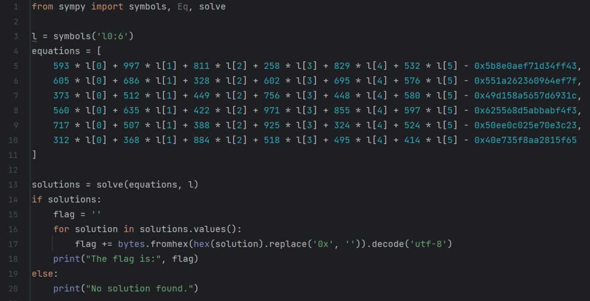{ width="70%" }

运行后即可得到原始的 flag 字符串，即为：`flag{N0_One_kn0ws_m@th_B3tter_Th@n_me!!!!}`

{ width="66%" }

------

#### Exp7:

下载题目，发现是一个可执行文件，打开之后需要我们输入 `Key` ，` Key` 的范围是 ` 0-100` ，我直接用爆破的方式了，解出来 `key` 是 23，输入之后，下面让我们输入 flag，我们将其拖入 `DIE` 查看，会发现他的 Packer 是 `PyInstaller`，从这里可以判断这个是用 `Py` 打包的方式生成的可执行文件：

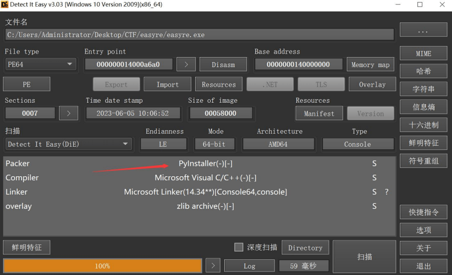{ width="70%" }

那么我们直接调用 `pyinstxtractor` 对其进行解包，拿到其中的 python 脚本文件 `(.pyc)` ，此程序的主要脚本是 `main.pyc` ，然后再使用 python 字节码反汇编工具 `pycdc` 得到正常的 python 源代码：

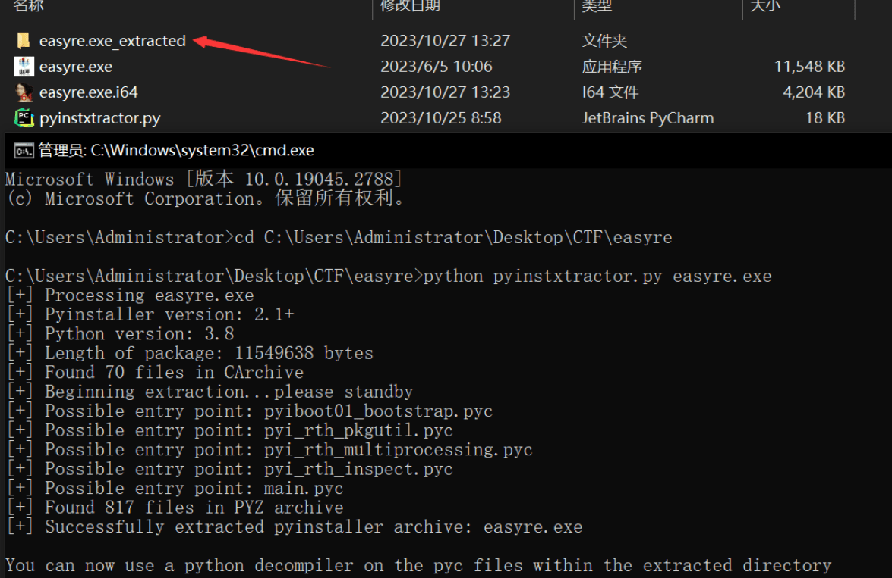{ width="70%" }

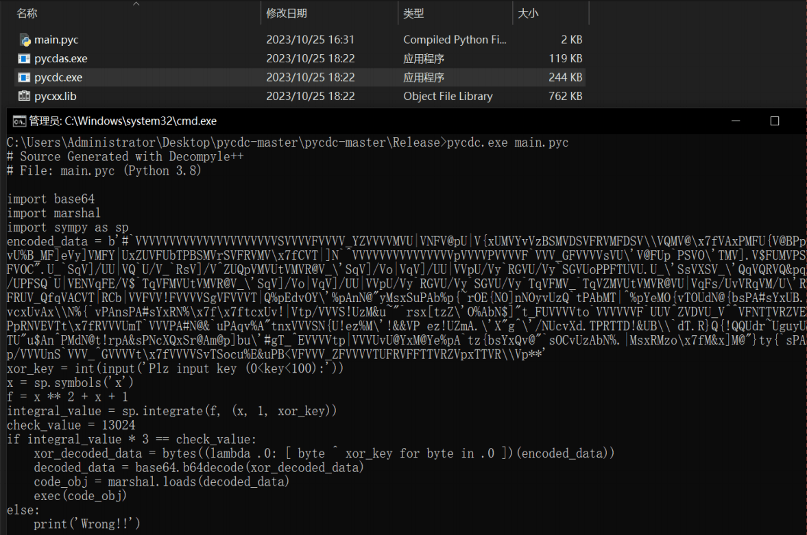{ width="70%" }

反汇编出来 python 源代码之后，我们要注意的是：我们需要配置与他的源代码一致的 python 环境，从反汇编的信息上来看，这个脚本是 `python3.8` 的版本，我们配置完环境之后直接调试这段代码即可，我们在图中指向的地方下断点，这里的主要目的是为了拿到他处理后的执行代码，`flag` 的字节就在里面。

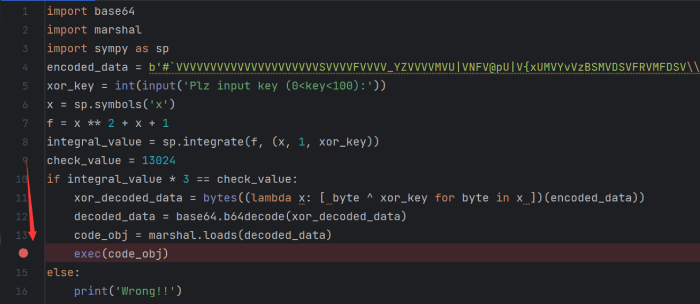{ width="70%" }

断下来之后，我们查看输出窗口，找到 `co_consts` ，展开就可以看到与 `flag` 有关的信息，从中我们可以看到，` flag` 是一个用 `rc4算法` 加密之后的字符串，并且加密时用的 `key` 也显示了出来。程序用 `rc4算法` 对你输入的 `flag` 进行加密，验证是否与加密后的 `flag` 相等，如果相等，就会输出 `yes`，否则输出 `no`，那么到了这里我们直接调用 `rc4` 的解密算法来对 `flag` 进行解密即可。

{ width="70%" }

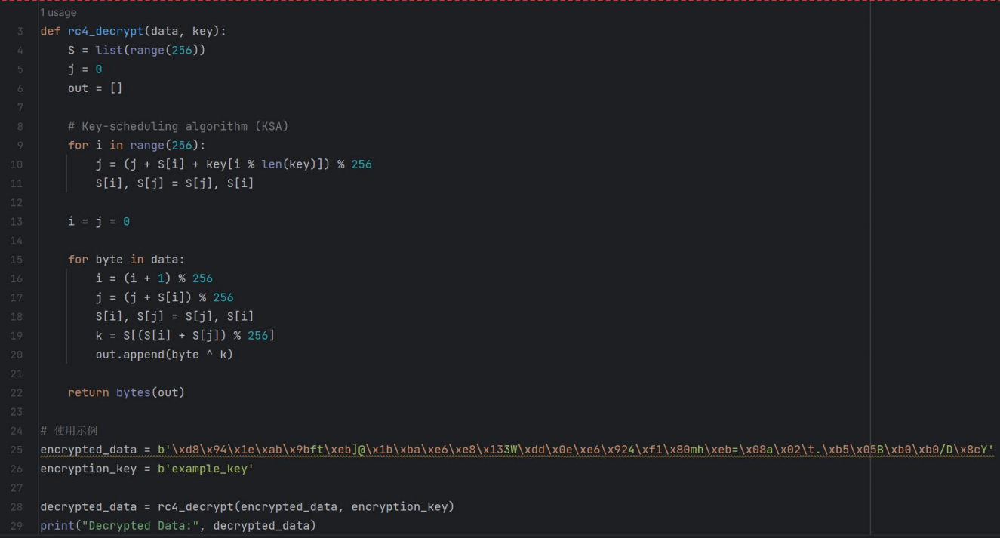{ width="70%" }

运行以上代码，即可得到 flag：`flag{d8e8d9d0-b2b1-7304-74b760-90b11ab6a3}`

{ width="66%" }

------

以上是 7 道基础的逆向题目，其中涉及到了很多知识点，包括但不限于 Python 语言、汇编语言、C++，以及 IDA 的使用、查壳工具的使用，还有 Python 解包工具等。这些东西需要我们日复一日的积累，熟能生巧，才可以熟记于心中。在需要的时候把它们拿出来用。