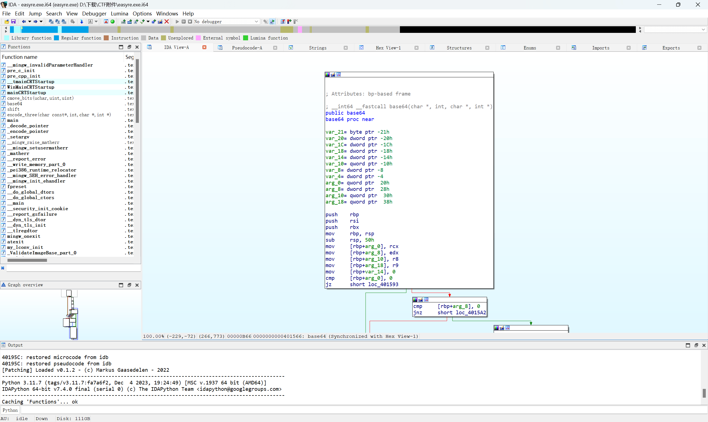
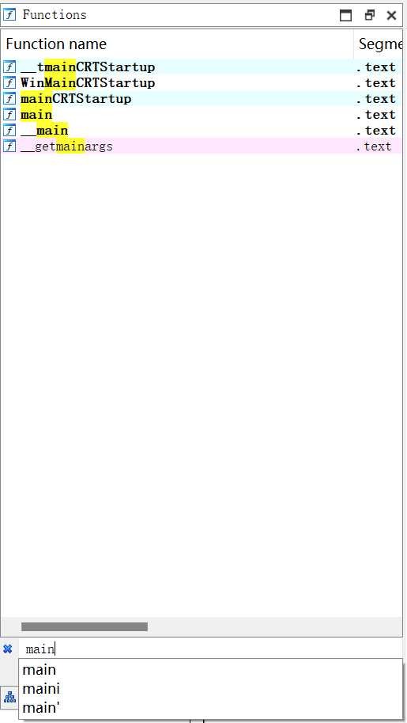
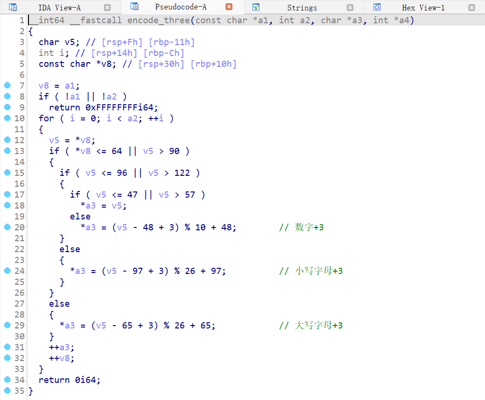
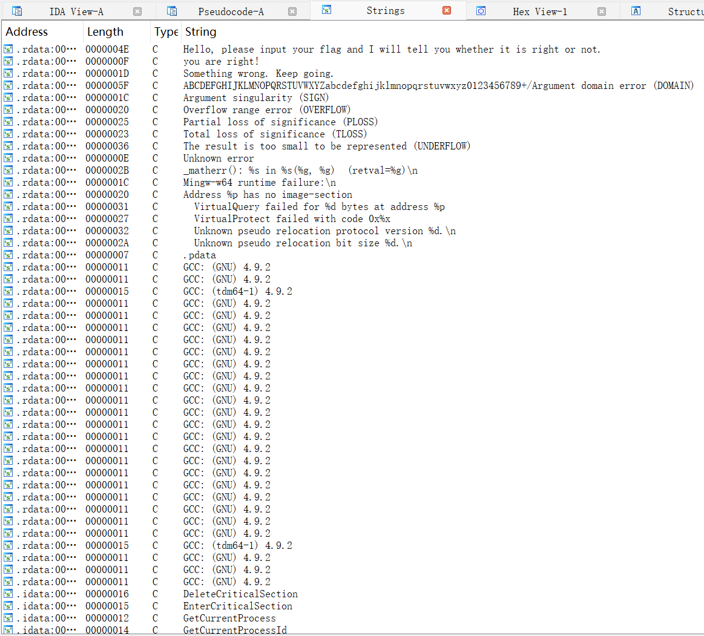

## 从零开始的IDA

对于re手来说，最基础和最重要的工具就是我们的 ~~老婆~~ **IDA** 了。

IDA Pro（Interactive Disassembler Professional）简称“IDA”，是Hex-Rays公司出品的一款交互式反汇编工具，是目前最棒的静态反编译软件~~之一~~。

随意打开一个文件，我们可以看到主界面

### Function
左边的Function视窗，我们可以看到程序内识别出的所有函数。
Ctrl+F还可以搜索我们想找的函数

### IDA View-A
右侧`IDA View-A`我们可以看到反汇编得到的汇编代码，以及控制流。

按空格键可以切换 **“平铺”** 和 **“控制流”** 两种模式。

平铺模式可以让我们看到所有代码在内存中保存的位置、顺序。

控制流模式可以让我们清晰地看到程序控制流的变化。

`IDA View-A`下的其他快捷键：

- `G`：指定地址跳转

- `P`：解析函数

- `C`：将数据转化为代码

- `D`：将代码转化为数据

- `Shift+E`：提取数据

在`IDA View-A`视窗下按`Tab`或`F5`就可以自动将汇编代码翻译成**伪C语言代码**。（也就是传说中的 **“万能F5”** ）
伪C代码可以近似当做C语言代码阅读，只是有些地方语法不一定准确，也会受到源程序编码语言的影响 ~~（如Rust语言反编译出的依托答辩）~~

### Pseudocode-A
`Pseudocode-A`视窗下的快捷键：
- `/`：添加注释
- `\`：隐藏类型描述
- `Y`：更改变量类型
- `R`：将选中的数字转换为相应的ASCII字符
- `X`：查看函数的交叉引用
- `N`：更改变量名称

### String
除此之外

- `Shift+F12`：打开String界面，查看字符串

至此，你就大致掌握了逆向工程最基础的静态分析工具！